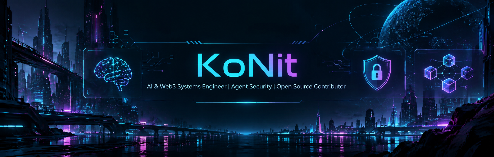

<p align="center">
  
</p>

<p align="center">
  <strong>AI & Web3 Systems Engineer | Agent Security | Open Source Contributor</strong>
</p>

<p align="center">
  
  
  
  
</p>

```text
╔══════════════════════ SYSTEM // ONLINE ══════════════════════╗
║  ID      : KoNit                                             ║
║  MODE    : BUILD · BREAK · SECURE · DECENTRALIZE             ║
║  FOCUS   : AI AGENTS · SECURITY · WEB3 · AI × FINANCE        ║
║  SIGNAL  : 721 PRs · 204 COMMITS · 3 MERGED PRs              ║
╚════════════════════════════════════════════════════════════════╝
```

I build and research systems at the intersection of **AI agents**, **agent security**, **decentralized infrastructure**, and **financial protocols**. My background is in Web3 and blockchain systems; my current work is increasingly focused on reliable agent infrastructure, adversarial evaluation, multi-agent systems, and AI × finance / Web3.

---

## ⚡ CURRENT FOCUS

| | Area | Current direction |
|---|---|---|
| 🤖 | **AI Agents & Agent Infrastructure** | Orchestration, multi-agent coordination, tool use, runtime reliability, and local/cloud agent systems |
| 🛡️ | **Agent Security** | Red teaming, adversarial evaluation, robustness, and safe credential / execution boundaries |
| ⛓️ | **Web3 Systems** | Wallets, smart contracts, DeFi/AMM systems, cross-chain infrastructure, and onchain financial applications |
| ◈ | **Research** | Mechanism design, game theory, and AI × decentralized / financial systems |

---

## 🛰️ OPEN SOURCE

### NousResearch / Hermes Agent

**Major contributor to [NousResearch/hermes-agent](https://github.com/NousResearch/hermes-agent)**, contributing across agent infrastructure, Desktop, reliability, tooling, and cross-platform behavior.

<p align="center">
  <a href="https://github.com/pulls?q=is%3Apr+author%3AKoNit-K"></a>
  <a href="https://github.com/NousResearch/hermes-agent/commits?author=KoNit-K"></a>
  <a href="https://github.com/NousResearch/hermes-agent/pulls?q=is%3Apr+is%3Amerged+author%3AKoNit-K"></a>
</p>

> **RELEASE CREDIT:** [Hermes Agent v0.21.2 (v2026.9.11)](https://github.com/NousResearch/hermes-agent/releases/tag/v2026.9.11) — listed among the release's **140 contributors**.

---

## 🤖 SELECTED WORK

### [RedTeamingAgent](https://github.com/KoNit-K/RedTeamingAgent)

> Automatic **multi-agent red-teaming framework** for evaluating AI-agent robustness.

Attacker, target, and evaluator agents operate in an iterative adversarial feedback loop, with configurable LLM backends and distributed execution through the Naptha SDK.

```text
ATTACKER  ──►  TARGET  ──►  EVALUATOR
    ▲                         │
    └────── feedback loop ◄───┘
```

---
<p align="center">
  
</p>

<h1 align="center">KoNit</h1>

## 🌐 BACKGROUND

My earlier work and research centered on blockchain and decentralized systems. I continue to work across **Web3 infrastructure, DeFi, smart contracts, and financial mechanisms**, while moving deeper into **AI-agent systems and agent security**.

I am particularly interested in problems where these areas overlap: **autonomous agents interacting with financial systems, secure tool-using agents, decentralized execution, and mechanism-aware AI systems**.

---

## 🧩 TECH STACK

<p align="center">
  
  
  
  
  
  
</p>

**Systems:** `LLM Agents` · `Multi-Agent Systems` · `Agent Security` · `EVM / DeFi` · `Smart Contracts` · `Distributed Systems` · `Wallet Infrastructure`

---

## 📡 COLLABORATION

Open to **open-source engineering**, **AI / agent-security research**, and technically serious work at the intersection of **AI, Web3, and financial systems**.

<p align="center">
  <code>BUILD // TEST // BREAK // SECURE // SHIP</code>
</p>
